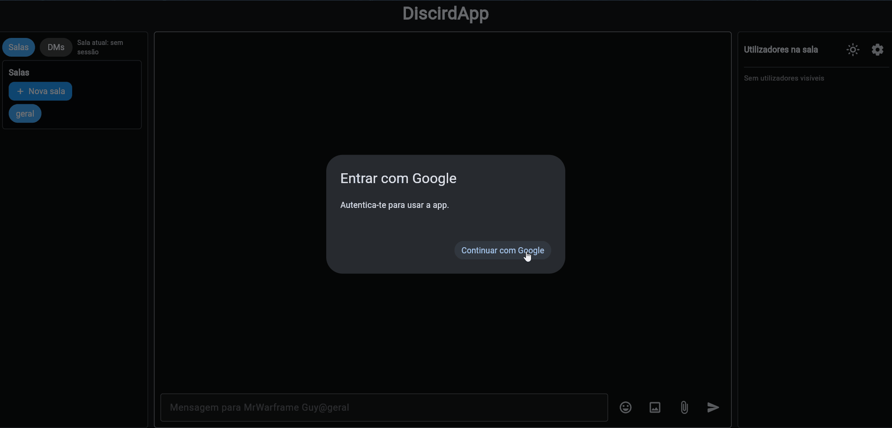
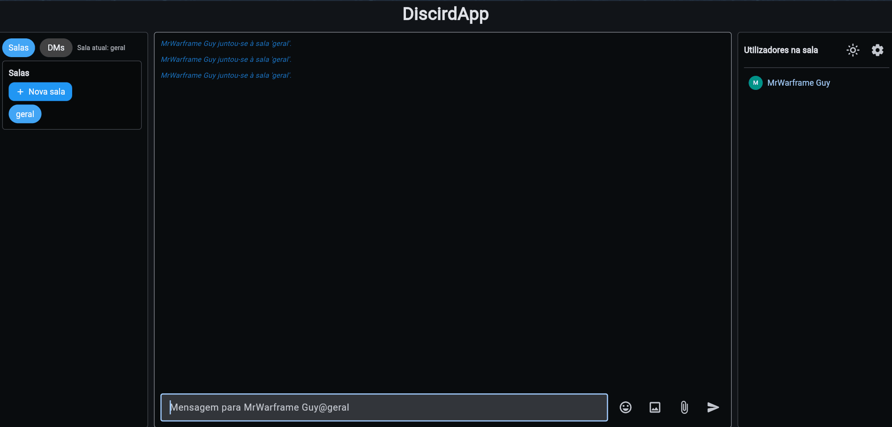

# DiscirdApp

A DiscirdApp foi desenvolvida no âmbito da unidade curricular de Computação Móvel com o objetivo de evoluir o chat base do tutorial oficial do <a href="https://flet.dev/docs/tutorials/chat/">Flet</a> para uma solução mais completa, com foco em colaboração, controlo de interações e robustez da experiência.

## Guia rápido

1. Criar e ativar ambiente virtual (Windows PowerShell):

```powershell
python -m venv venv
. .\venv\Scripts\Activate.ps1
```

2. Instalar dependências:

```powershell
pip install -r requirements.txt
```

3. Configurar credenciais Google no ficheiro auth.env:

```env
GOOGLE_CLIENT_ID= 'obtido quando criado o auth no google cloud'
GOOGLE_CLIENT_SECRET= 'obtido no google cloud'
GOOGLE_REDIRECT_URL= 'url definido na google cloud'
```

4. Executar a aplicação:

```powershell
flet run --web --port 60123 chat.py
```

## Funções da aplicação

- ➕ Criar salas de chat.
- 📥 Enviar mensagens privadas entre utilizadores.
- 📎 Enviar ficheiros (e.g., imagens, documentos, etc.).
- 📋 Editar e eliminar mensagens.
- 😎 Reações por emoji a mensagens, com contagem visível por reação.

Estas foram funções implementadas como parte do meu segundo objetivo que considero que sejam imperativas para uma aplicação básica de chat funcionar.

### Funções extra (escolhidas por mim)

- Autenticação Google OAuth 2.0.
- Persistência de histórico com JSON + DuckDB.
- Teclado para emojis 😁
- Botão para alternar tema claro/escuro
- Botão de definições que permite fazer o logout ou alterar o fundo da app
- Navegação e routing

Abaixo irei mencionar o porquê de ter escolhido estas funcionalides para a minha aplicação

## Autenticação Google OAuth 2.0 e gestão de sessão

Esta funcionalidade foi escolhida para o terceiro objetivo por introduzir um mecanismo avançado de identidade e sessão, acima do comportamento mínimo de um chat local. A principal motivação foi garantir autenticidade dos utilizadores e reduzir ambiguidade na autoria das mensagens. Num contexto académico, onde o chat é usado para coordenação de trabalho de grupo, partilha de ficheiros e interações assíncronas, é importante que cada participante esteja associado a uma identidade estável e verificável. Sem autenticação, qualquer utilizador pode assumir nomes diferentes em cada execução, o que fragiliza rastreabilidade e credibilidade das conversas.

Tecnicamente, a app carrega as variáveis GOOGLE_CLIENT_ID, GOOGLE_CLIENT_SECRET e GOOGLE_REDIRECT_URL a partir de auth.env, inicializa o GoogleOAuthProvider e conclui o fluxo OAuth por callback. Depois do login, é feito bootstrap automático da sessão: ativação do utilizador na interface, subscrição ao tópico principal e ao tópico pessoal (necessário para DMs), abertura da sala por defeito e ativação de controlos bloqueados para não autenticados. Para aumentar robustez, foi incluída lógica de finalização com tentativas de repetição quando a autenticação chega com atraso (cenário comum em callbacks). Existe ainda término de sessão com limpeza de estado local, removendo dados ativos e devolvendo a aplicação ao estado inicial de autenticação. Assim, esta funcionalidade melhora segurança, consistência de identidade e previsibilidade de comportamento no uso real.

### Como utilizar

- Na primeira abertura, clicar em "Continuar com Google".
- Concluir o consentimento no browser e regressar automaticamente ao chat.
- Para terminar sessão, abrir Definições e selecionar "Terminar sessão".

## Persistência de histórico (JSON + DuckDB)

A persistência foi escolhida como segunda funcionalidade avançada do terceiro objetivo por resolver um problema estrutural: sem armazenamento, todo o contexto desaparece ao fechar a aplicação. Para uso real, especialmente em trabalho académico distribuído por tempo, é essencial preservar histórico de salas, DMs e estados de mensagens. Esta decisão aumenta confiabilidade do sistema e continuidade de trabalho entre sessões.

O desenho adota estratégia híbridá: DuckDB como armazenamento preferencial e JSON como fallback de segurança. O estado global inclui salas, histórico por sala, conversas privadas e ocultações locais. Em cada alteração relevante (novas mensagens, reações, edições, eliminações, criação de sala), o estado é serializado e persistido. Na inicialização, o sistema tenta carregar do DuckDB e se não houver dados válidos, recorre ao JSON. Existe ainda migração automática de JSON para DuckDB quando a dependência está disponível, preservando compatibilidade com execuções anteriores.

Esta abordagem foi intencional para equilibrar robustez e portabilidade. DuckDB melhora estrutura e evolução futura dos dados, enquanto JSON garante resilência mínima em cenários degradados. O resultado é uma base consistente para crescimento da aplicação sem perda de histórico.

### Como utilizar

- Utilizar normalmente o chat, a persistência é automática.
- Fechar e reabrir a aplicação para verificar recuperação de salas, mensagens e DMs.
- Manter o ficheiro chat_history.duckdb (ou chat_history.json, em fallback) para não perder histórico.

## Menu para alterar o fundo da conversa ou fazer o logout




Decidi adicionar um botão que abre um menu para mudar o fundo da aplicação e para fazer o logout.<br/>O botão de logout foi adicionado porque penso que seja imperativo uma vez que se faça o login poder fazer logout quando pretendido.<br/>A seleção de fundos de conversa foi adicionada para adicionar customização personalizada a cada utilizador.

## Notas

- O ficheiro auth.env contém credenciais sensíveis e não deve ser partilhado publicamente.
- Em Windows com Anaconda instalado, ativar o venv antes de usar comandos Flet para evitar conflitos de versão.

## Planos para o futuro

Ao longo do desenvolvimento da app aprendi conceitos novos como autenticação e persistência de dados e tentei inspirar-me numa aplicação digna de ser uma chat room fiável, ao que penso que tenha já funções bastante boas para uma base sólida.<br/><br/>No futuro planeio adicionar as seguintes funções:

- Página de perfil (útil para qualquer utilizador)
- Tela de registo/login
- Novas formas de autenticação (AppleID, Github, X)
- Estado online/ausente/offline
- Adicionar/remover amigos
